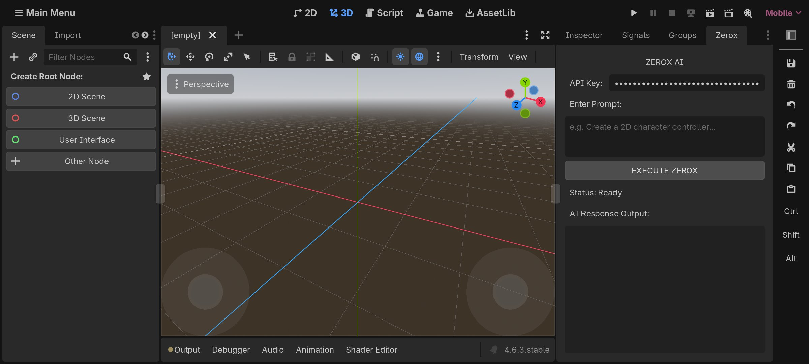
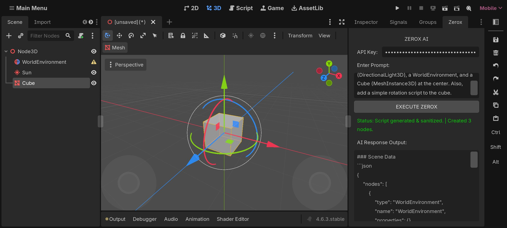

<div align="center">

<!-- Animated Header Banner -->


<!-- Animated Typing Title -->
<a href="https://github.com/zeroxn8877021/ZEROX-AI-GODOT-ADDONS-">
  
</a>

<br/>

<!-- Badges Row -->
<p>
  
  
  
  
  
</p>

<p>
  
  
  
</p>

</div>

---

<!-- Divider Animation -->
<div align="center">
  
</div>

---

## ⚡ What is ZEROX AI?

> **ZEROX AI** is a powerful **Godot 4 Editor Plugin** that lets you build complete game scenes using simple text prompts — powered by AI.
> No more manually dragging nodes, writing boilerplate scripts, or setting up environments by hand.
> **Just describe what you want. ZEROX does the rest.**

<div align="center">

```
📝 You Type:  "Create a 3D scene with a DirectionalLight, WorldEnvironment, and a rotating Cube"
         ↓
🤖 ZEROX AI:  Generates the scene • Creates nodes • Attaches scripts
         ↓
🎮 Godot:     Your scene is ready — instantly.
```

</div>

---

<div align="center">
  
</div>

---

## 🖼️ Before & After

<div align="center">

| 🔴 BEFORE — Empty Scene | 🟢 AFTER — AI Generated |
|:---:|:---:|
|  |  |
| No nodes, no scripts, empty viewport | AI created nodes + rotation script in seconds |

</div>

---

## 🎬 Features

<div align="center">

| Feature | Description |
|:---:|:---|
| 🧠 **AI Scene Generation** | Describe any scene in plain English and watch it come to life |
| ⚙️ **Auto Node Creation** | Automatically adds Nodes like `MeshInstance3D`, `DirectionalLight3D`, `Camera3D` |
| 📜 **Script Generation** | Writes and attaches GDScript to nodes automatically |
| 🔒 **Script Sanitization** | AI output is cleaned and validated before execution |
| 🎯 **Inspector Panel** | Clean built-in UI with API Key input, prompt field, and status display |
| 🌐 **API Flexible** | Works with OpenAI, Claude, or any compatible LLM API |
| 🚀 **One-Click Execute** | Hit **EXECUTE ZEROX** and your scene builds itself |

</div>

---

<div align="center">
  
</div>

---

## 📁 Repository Structure

```
ZEROX-AI-GODOT-ADDONS-/
│
├── 📁 Assets/
│   ├── 📁 Images/
│   │   ├── 🖼️  before.jpg          ← Scene before using ZEROX AI
│   │   └── 🖼️  after.jpg           ← Scene after AI generation
│   │
│   └── 📁 Source/
│       └── 📦 addons.zip           ← ⭐ DOWNLOAD THIS — The Addon Package
│
└── 📄 README.md
```

---

## 🚀 Getting Started

### Step 1 — Download Godot 4

> ZEROX AI requires **Godot Engine 4.x**

<div align="center">

[](https://godotengine.org/download)

</div>

---

### Step 2 — Download the Addon

<div align="center">

[](https://github.com/zeroxn8877021/ZEROX-AI-GODOT-ADDONS-/raw/main/Assets/Source/addons.zip)

</div>

Or clone the full repo:
```bash
git clone https://github.com/zeroxn8877021/ZEROX-AI-GODOT-ADDONS-.git
```

---

### Step 3 — Install the Addon

```
1. Open your Godot 4 project (or create a new one)

2. In your project folder, create an "addons" folder if it doesn't exist:
   YourProject/
   └── addons/   ← create this

3. Extract addons.zip into that folder:
   YourProject/
   └── addons/
       └── zerox_ai/       ← contents of the zip go here
           ├── plugin.cfg
           └── ... (other files)
```

---

### Step 4 — Enable the Addon in Godot

```
1. Open Godot → Your Project

2. Go to:  Project  →  Project Settings  →  Plugins  (top tab)

3. Find "ZEROX AI" in the list

4. Toggle the checkbox to  ✅ Enable

5. The "Zerox" tab will now appear in your top-right Inspector panel
```

<div align="center">
  
  <br/>
  <em>ZEROX AI panel visible in the Inspector area after enabling</em>
</div>

---

### Step 5 — Get Your API Key

ZEROX AI uses an AI language model. You need an API key from one of these providers:

<div align="center">

| Provider | Get Key |
|:---:|:---:|
| 🟢 **OpenAI (GPT-4)** | [platform.openai.com/api-keys](https://platform.openai.com/api-keys) |
| 🟣 **Anthropic (Claude)** | [console.anthropic.com](https://console.anthropic.com) |

</div>

---

### Step 6 — Use ZEROX AI

```
1. Click the "Zerox" tab in the top-right of Godot Editor

2. Paste your API Key in the "API Key:" field

3. Type your scene description in "Enter Prompt:"
   Example: "Create a 3D scene with a sun, world environment, and a rotating cube"

4. Click  [ EXECUTE ZEROX ]

5. Watch the magic — nodes appear in your scene tree instantly ✨

6. Status bar will show:
   ✅ "Script generated & sanitized. | Created X nodes."
```

---

<div align="center">
  
</div>

---

## 💡 Example Prompts

```gdscript
// 🎮 3D Scene
"Create a 3D scene with DirectionalLight3D, a WorldEnvironment, and a Cube at center. Add rotation script."

// 🧍 Character Setup
"Create a CharacterBody3D player with collision shape and basic movement script"

// 🌍 Environment
"Add a sky with sun, fog, and ambient lighting to the current scene"

// 🏗️ Level Design
"Create a simple platform level with 5 platforms at different heights using StaticBody3D"

// 🎯 UI
"Create a HUD with health bar, score label, and pause button using Control nodes"
```

---

## ⚙️ How It Works — Under the Hood

```
User Types Prompt
      ↓
ZEROX AI Panel (Godot Plugin)
      ↓
API Call → AI Model (GPT / Claude)
      ↓
AI Returns Scene Data (JSON format)
      ↓
Script Sanitizer checks output
      ↓
GDScript executes in Godot Editor
      ↓
Nodes are created in Scene Tree
      ↓
Scripts attached to relevant nodes
      ↓
✅ Done — Your scene is ready!
```

---

<div align="center">
  
</div>

---

## 👨‍💻 Credits & Team

<div align="center">

| Role | Name | Handle |
|:---:|:---:|:---:|
| 🧠 **Lead Developer & Creator** | **Paras Sharma** | [@zeroxn8877021](https://github.com/zeroxn8877021) |
| 🎮 **Team** | **Zerox** | [github.com/zeroxn8877021](https://github.com/zeroxn8877021) |

<br/>

> _"Built with passion by Team Zerox — making AI accessible inside game engines."_
> — **Paras Sharma**

</div>

---

## 📋 Requirements

| Requirement | Version |
|:---|:---:|
| Godot Engine | `4.x (4.6.3.stable tested)` |
| Internet Connection | Required (for API calls) |
| AI API Key | OpenAI / Anthropic / Compatible |
| OS | Windows, Linux, macOS |

---

## 🐛 Troubleshooting

<details>
<summary><b>❓ Addon not showing in Project Settings → Plugins?</b></summary>

Make sure the folder structure is correct:
```
res://addons/zerox_ai/plugin.cfg   ← this file must exist
```
Then restart Godot and check again.
</details>

<details>
<summary><b>❓ "EXECUTE ZEROX" button does nothing?</b></summary>

- Check that your API Key is entered correctly
- Make sure you have an internet connection
- Check the Output panel at the bottom for any error messages
</details>

<details>
<summary><b>❓ Nodes are created but no script attached?</b></summary>

Some prompts may not trigger script generation. Be specific:
> "...and add a GDScript rotation script to the cube"
</details>

---

<div align="center">
  
</div>

---

## ⭐ Support the Project

<div align="center">

If ZEROX AI saved you time, give it a star! ⭐

[](https://github.com/zeroxn8877021/ZEROX-AI-GODOT-ADDONS-)

[](https://github.com/zeroxn8877021)

</div>

---

## 📄 License

```
MIT License — Free to use, modify, and distribute.
© 2024 Paras Sharma / Team Zerox
```

---

<!-- Footer Wave -->
<div align="center">
  
</div>

